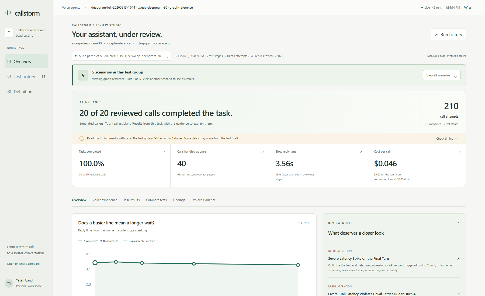
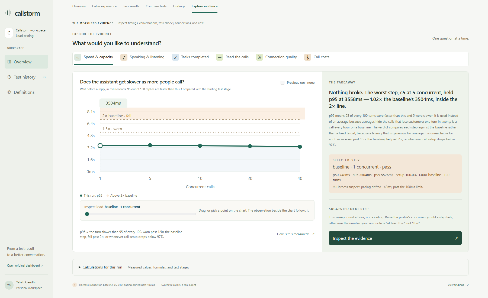
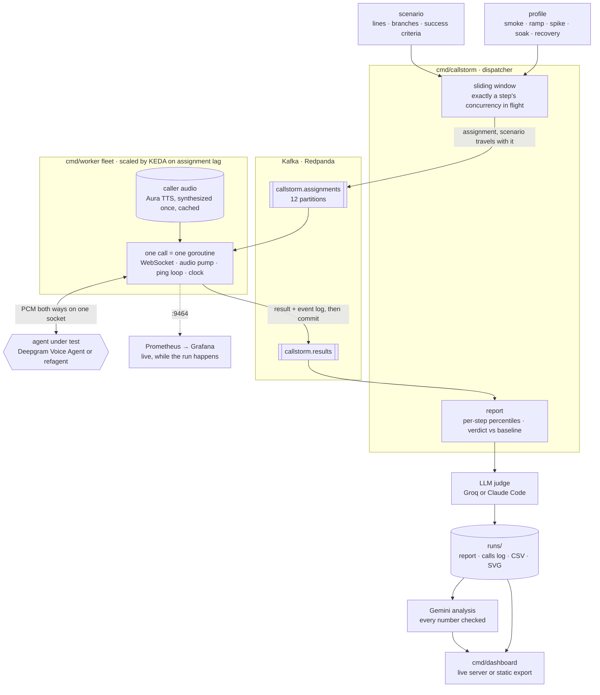

# Callstorm

**Load-test voice AI agents. See what callers experienced—and whether the job got done.**

[](LICENSE)
[](go.mod)

Callstorm places scripted voice calls against an assistant, increases the load,
and measures reply speed, conversation quality, task completion, and cost.
Its dashboard connects each finding to the calls and measurements behind it.



[Quickstart](#quickstart) · [Dashboard](#explore-the-results) · [Technical guide](docs/technical-guide.md) · [Contributing](CONTRIBUTING.md)

## What can you learn?

| Question | What Callstorm shows |
| --- | --- |
| Does the assistant get slower when more people call? | Per-stage reply-time percentiles, load sweeps, and degradation against a baseline. |
| Did callers get what they asked for? | Scenario checks and optional transcript-based task review, with quoted evidence. |
| Where does the waiting happen? | Wait bands, reply-position timings, and the split between detecting the end of speech and producing audio. |
| Does the conversation hold up? | Transcription errors, interruptions, speaking balance, repeated replies, and long silences. |
| What changes on a poor connection? | Optional network-impairment tests and comparisons against a clean connection. |
| Can I trust the test? | A calibrated reference agent, call-level event logs, and warnings when the test system falls behind. |

Callstorm currently supports the **Deepgram Voice Agent WebSocket protocol**,
including a local reference target. It is not a general phone dialer: SIP/PSTN
calling and arbitrary provider adapters are not implemented.

## Quickstart

### 1. Explore the included reports

Requires **Go 1.25 or newer**. No API key is needed to browse saved results.

```sh
git clone https://github.com/ai-calypse/callstorm.git
cd callstorm
go run ./cmd/dashboard -runs runs -addr 127.0.0.1:8090
```

Open **[the dashboard](http://127.0.0.1:8090/)**. Stop the server with `Ctrl+C`.

The dashboard loads React and htm from a CDN, so the first browser load needs
internet access. Node.js is needed for frontend checks, not for serving it.

### 2. Configure credentials before placing calls

Copy [`.env.example`](.env.example) to `.env`, then set the keys you need:

```dotenv
DEEPGRAM_API_KEY=your_deepgram_key
```

| Key | Used for |
| --- | --- |
| `DEEPGRAM_API_KEY` | Caller speech synthesis and the default Deepgram target. Required by the current CLI. |
| `GROQ_API_KEY` | Optional task review using `-judge-backend groq`. |
| `GEMINI_API_KEY` | Optional written analysis of recorded runs. When set, analysis runs automatically after tests. Without it, `-insights <dir> -insights-backend claude-code` writes analyses through the Claude Code CLI. |

Values in `.env` **override** the inherited environment. Caller speech is
cached after synthesis; new audio, real-agent calls, and optional model-based
reviews can incur provider charges. A reference-agent test still needs the
CLI key and may synthesize caller audio on its first run.

### 3. Test against the local reference agent

The reference agent responds with audio tones after a configured delay. It
checks the timing harness without needing a real assistant to reason or speak.

In one terminal:

```sh
go run ./cmd/refagent -addr 127.0.0.1:8080 -ttfa 800ms -endpointing 300ms
```

In another terminal, from the repository root:

```sh
go run ./cmd/callstorm -target ws://127.0.0.1:8080/v1/agent/converse
```

Then run a concurrency sweep:

```sh
go run ./cmd/callstorm -target ws://127.0.0.1:8080/v1/agent/converse -profile profiles/sweep-local.json -max-concurrency 100
```

To test the real Deepgram agent configured in the scenario, omit `-target`:

```sh
go run ./cmd/callstorm -scenario scenarios/refund.json -profile profiles/smoke-deepgram.json
```

Start small, then choose a larger [load profile](profiles/) appropriate to the
target's limits. Run `go run ./cmd/callstorm -h` for all options.

## Explore the results

The dashboard organizes a test around these views:

- **Overview:** what was achieved, how reply speed changed, and what needs attention.
- **Caller experience:** how often callers waited and which conversation moments were slow.
- **Task results:** missed requirements, sample counts, example conversations, and whether misheard calls were the ones that failed.
- **Compare scenarios:** for a test made of several scenarios, each one side by side on reply wait, task success, the slowest moment, wait bands, and mishearing.
- **Compare tests:** differences between tests with matching recorded conditions.
- **Findings:** written analysis and plain-language answers, with unanswered questions grouped separately.
- **Explore evidence:** timings, transcripts, task checks, connection quality, costs, and calculation tables.



*Screenshots show an included synthetic test. They are examples of the interface,
not general performance claims. This report flags test-timing drift; that caveat
is part of the result.*

A run can connect every call and still fail the task. It can also stay close
to its baseline while being slow at every load. Callstorm keeps these questions
separate so one green number does not hide the rest of the story.

### Read the verdict correctly

**Time to first audio (TTFA)** is the wait from the caller finishing speech to
the assistant's first audio byte. **p95** is the threshold met by 95% of the
measured replies in a test stage.

The latency verdict compares each stage with the run's baseline:

| Verdict | Rule |
| --- | --- |
| Pass | p95 is at most 1.5× baseline. |
| Warn | p95 is above 1.5× and at most 2× baseline. |
| Fail | p95 exceeds 2× baseline, or fewer than 97% of call attempts connect. |

The 2× fail line is the benchmark [Coval's load-testing guide](https://www.coval.ai/blog/voice-load-testing-methodology)
cites; the 1.5× warn line is Callstorm's own.

Task and conversation-quality checks are reported separately. Percentiles
stay within their stage; missing measurements stay missing. Published reference
lines provide context and do not replace the relative verdict. Every published
line is listed with its page under [Sources](#sources).

## Scenarios, reviews, and artifacts

A [scenario](scenarios/refund.json) defines caller lines, the assistant
configuration, and optional success criteria. Scenarios can include branches,
personas, and deliberate interruptions. A [profile](profiles/sweep-local.json)
defines the call load and the baseline stage.

To review sampled calls against the scenario's success criteria:

```sh
go run ./cmd/callstorm -scenario scenarios/refund.json -profile profiles/smoke-deepgram.json -judge -judge-backend groq
```

This requires `GROQ_API_KEY` as well as `DEEPGRAM_API_KEY`. The default is one
reviewed call per stage; use `-judge-calls N` to change the sample, or `0` to
review every call. The judge assesses transcripts, not whether an external
booking, payment, or database write actually occurred.

Sweeps write reports under `runs/`: JSON measurements, CSV summaries, SVG
charts, and call logs. Depending on enabled features, a run also has task
judgements and written analysis. The dashboard reads these files directly;
no analytics database is required.

Use `-out` to choose another artifact directory and `-suite` to group related
scenarios into a test. Before sharing artifacts, check their contents: call
logs include transcripts, and reports can include target configuration.

## Architecture



The dispatcher decides the load and the fleet supplies the capacity. Kafka
carries calls out and results back, and nothing else passes between them.

Single-machine tests run locally. Distributed tests send assignments through
Kafka to a worker fleet; the dispatcher controls concurrency. Kubernetes,
autoscaling, Prometheus/Grafana, and Linux network-impairment configurations
are available under [`deploy/`](deploy/).

See the [technical guide](docs/technical-guide.md) for architecture details,
calibration, phase behavior, measurement boundaries, and deployment examples.

## Development

```sh
go test ./...
go build ./cmd/...
```

For dashboard rendering checks, with Node.js and npm installed:

```sh
cd cmd/dashboard/ui
npm install
npm run check
```

| Path | Purpose |
| --- | --- |
| [`cmd/callstorm/`](cmd/callstorm/) | Test CLI and dispatcher. |
| [`cmd/dashboard/ui/`](cmd/dashboard/ui/) | The dashboard page, its stylesheets, and its render checks. |
| [`cmd/refagent/`](cmd/refagent/) | Reference target with controlled timings. |
| [`internal/`](internal/) | Audio, timing, load generation, reviews, and transport. |
| [`scenarios/`](scenarios/) · [`profiles/`](profiles/) | Example conversations and test configurations. |
| [`deploy/`](deploy/) | Observability and Kubernetes configurations. |

The Go module path remains `github.com/yakshgandhi/callstorm`; the repository
is hosted at `github.com/ai-calypse/callstorm`.

### Export a report site

```sh
go run ./cmd/dashboard -runs runs -export dist
```

This exports the dashboard and report data as static files. The repository
includes a GitHub Pages workflow and Vercel configuration for the static export.

## Sources

These are the published pages behind every figure Callstorm credits to another
company or a study: the verdict lines, wait bands, reference lines, and
measurement definitions. The dashboard lists the same pages under
**Definitions → Sources**. Dates are those the pages gave when read.

**Hamming**

| Page | What Callstorm takes from it |
| --- | --- |
| [Voice AI Latency: What's Fast, What's Slow, and How to Fix It](https://hamming.ai/resources/voice-ai-latency-whats-fast-whats-slow-how-to-fix-it) (2026-01-12) | The 800ms target for the wait after a caller stops; the 1.4s–1.7s median reported for production agents. |
| [Voice Agent Analytics & Post-Call Metrics](https://hamming.ai/resources/voice-agent-analytics-post-call-metrics-definitions-formulas-dashboards) (2026-02-10) | Time to first word from VAD silence detection, breakdown past 800ms, under 300ms as natural, interruptions above 10% of turns as poor. |
| [Voice Agent Load Testing Guide](https://hamming.ai/resources/voice-agent-load-testing-guide) (2026-05-17) | Task completion under load: within 5% of baseline passes, a 5–10% drop warns, more than 10% fails. |
| [Voice Agent Testing Guide](https://hamming.ai/resources/voice-agent-testing-guide) (2026-01-23) | A ±2% tolerance on word error rate before a change counts as a regression. |
| [Voice Agent Evaluation Metrics](https://hamming.ai/resources/voice-agent-evaluation-metrics-guide) (2026-01-18) | Word error rate above 15% as poor. |
| [Testing Voice Agents for Production Reliability](https://hamming.ai/resources/testing-voice-agents-production-reliability) (2025-12-31) | Failed-turn bands: under 0.5% good, under 1% acceptable, above 1% critical. |
| [Voice Agent Drop-Off Analysis](https://hamming.ai/resources/voice-agent-drop-off-analysis-abandonment-framework) (2026-01-28) | Each 100ms past 800ms costing 4–6% of task completion, which the slow-calls split checks. |
| [How to Measure Conversational Flow in Voice Agents](https://hamming.ai/resources/conversational-flow-measurement-voice-agents) (2025-12-29) | Repeated questions under 3% as excellent, the line on the repeated-replies chart. |

**Coval**

| Page | What Callstorm takes from it |
| --- | --- |
| [Voice Load Testing: How to Simulate 10,000 Concurrent Calls](https://www.coval.ai/blog/voice-load-testing-methodology) (2026-03-07) | The latency fail line, p95 no more than 2× baseline at peak load (given there as a common industry benchmark); p95 under 2s. |
| [Voice AI Latency: What Causes Delays and How to Fix Them](https://www.coval.ai/blog/voice-ai-latency) (2026-03-03) | Past 1,200ms callers start repeating themselves, talking over the agent, or hanging up. |
| [Time to First Audio, Measured Right](https://www.coval.ai/blog/time-to-first-audio-ttfa-benchmark) (2026-09-08) | Where audible sound starts: the first 10ms window, stepped 1ms, with RMS above 0.01; one provider's median 225ms of leading silence. |
| [Statistical Metrics](https://docs.coval.ai/concepts/metrics/types/statistical) (docs) | Loop Detection and Agent Repeats Itself: repeated agent replies as a sign of a stuck conversation. |
| [Write judge prompts](https://docs.coval.ai/concepts/metrics/writing-judge-prompts) (docs) | How the task judge is prompted. |

**Cekura, research, and Deepgram**

| Page | What Callstorm takes from it |
| --- | --- |
| [Cekura: Voice AI Latency: How to Monitor and Improve Every Layer](https://www.cekura.ai/blogs/voice-ai-latency-guide) (2026-09-03) | The latency boundary table, the 208ms human reply gap, and why a clock that starts after endpointing hides part of the wait. |
| [Stivers et al., Universals and cultural variation in turn-taking in conversation](https://doi.org/10.1073/pnas.0903616106) (PNAS, 2009) | The study behind the 208ms mean gap between speakers across languages. |
| [Deepgram pricing](https://deepgram.com/pricing) (read 2026-09-13) | Voice Agent rates, billed by connection time, for pricing a run without a given rate. |
| [Deepgram API rate limits](https://developers.deepgram.com/reference/api-rate-limits) | Voice Agent concurrency limits behind the preflight's cap on calls at once. |
| [Deepgram Voice Agent API](https://developers.deepgram.com/docs/voice-agent) | The WebSocket protocol Callstorm speaks, and its default target. |
| [Deepgram text-to-speech](https://developers.deepgram.com/docs/text-to-speech) | The voices that synthesize the caller's lines. |

## Contributing

Bug reports, measurement fixes, new scenarios, and dashboard improvements are
welcome. Read [CONTRIBUTING.md](CONTRIBUTING.md) for setup, validation, and
guidance on sharing reproducible examples.

Use [GitHub Issues](https://github.com/ai-calypse/callstorm/issues) to report
bugs or discuss a substantial change before implementing it.

## License

[MIT](LICENSE). See the [MIT license reference](https://opensource.org/license/mit)
for the standard license text.
