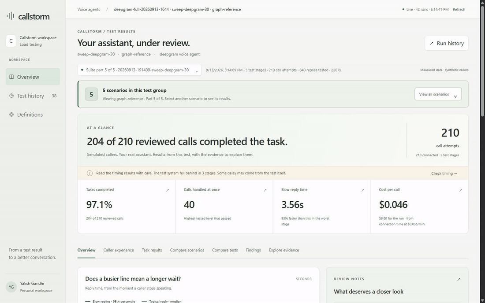
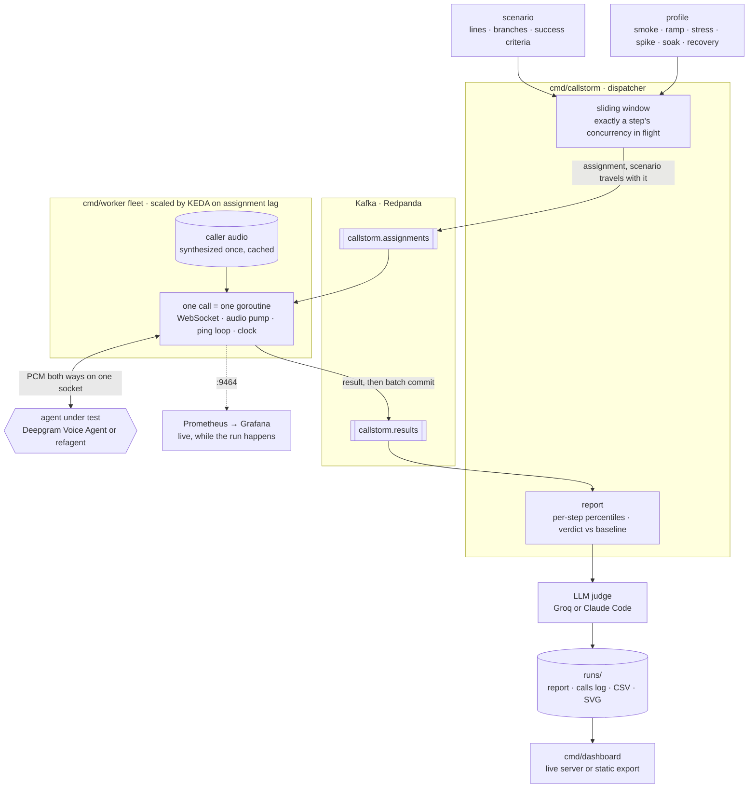

<div align="center">

# Callstorm

### Load testing for voice AI agents that reports what callers heard, not just how fast the socket answered

**Scripted callers. Real concurrency. A verdict that separates "replied quickly" from "did the job".**

<br/>

[](https://ai-calypse.github.io/callstorm/)
[](https://github.com/ai-calypse/callstorm/actions/workflows/pages.yml)
[](go.mod)
[](https://developers.deepgram.com/docs/voice-agent)
[](runs/)
[](LICENSE)

**Built with**

[](go.mod)
[](internal/bus/)
[](deploy/k8s/10-redpanda.yaml)
[](deploy/)
[](deploy/overlays/keda/scaler.yaml)
[](deploy/monitoring/prometheus.yml)
[](deploy/monitoring/grafana/provisioning/dashboards/callstorm.json)
[](Dockerfile)
[](https://developers.deepgram.com/docs/voice-agent)
[](cmd/dashboard/ui/)
[](internal/judge/)
[](.github/workflows/pages.yml)

<br/>

### **[Open the live dashboard](https://ai-calypse.github.io/callstorm/)**

Every report in it comes from a committed run. Nothing is mocked.



<br/>

> **A voice agent can answer in 800 milliseconds and still be wrong. Callstorm places hundreds of scripted calls at once, times every turn, checks whether the caller got what they asked for, and refuses to hide one behind the other.**

</div>

---

# What can you learn?

| Question | What Callstorm shows |
| --- | --- |
| **Does the assistant get slower when more people call?** | Per-stage reply-time percentiles, load sweeps, and degradation against a baseline. |
| **Did callers get what they asked for?** | Scenario checks and optional transcript-based task review, with quoted evidence. |
| **Where does the waiting happen?** | Wait bands, reply-position timings, and the split between detecting the end of speech and producing audio. |
| **Does the conversation hold up?** | Transcription errors, interruptions, speaking balance, repeated replies, and long silences. |
| **What changes on a poor connection?** | Optional network-impairment tests and comparisons against a clean connection. |
| **Can I trust the test?** | A calibrated reference agent, call-level event logs, and warnings when the test system falls behind. |

Callstorm speaks the **Deepgram Voice Agent WebSocket protocol**, including a local reference target. It is not a general phone dialer: SIP and PSTN calling and other provider adapters are not implemented.

---

# Latest measurements

<!-- metrics:start -->
**Latest run against a real agent:** [`20260913-191409-sweep-deepgram-30`](runs/deepgram-full-20260913-1644/20260913-191409-sweep-deepgram-30.json), scenario `graph-reference`, profile `sweep-deepgram-30`, suite `deepgram-full-20260913-1644`. Started 2026-09-13 19:14 UTC, 210 calls, 210 connected, 840 turns, 204 of 210 judged calls completed the task (claude code claude-sonnet-5).

| Metric | Baseline: `baseline`, 1 at once | Peak: `c40`, 40 at once |
| --- | ---: | ---: |
| Time to first audio, p50 | 748 ms | 748 ms |
| Time to first audio, p95 | 3.50 s | 3.36 s |
| Time to first audio, p99 | 5.53 s | 3.54 s |
| Agent-reported TTFA, p95 | 3.42 s | 3.27 s |
| Endpointing, p50 | 300 ms | 300 ms |
| Endpointing, p95 | 341 ms | 324 ms |
| Think + speak, p95 | 3.25 s | 3.12 s |
| Turn latency, p95 | 9.17 s | 8.86 s |
| Transport round trip, p50 | 81 ms | 83 ms |
| Replies past 800 ms | 41.7% | 36.9% |
| Word error rate, mean | 5.6% | 4.6% |
| Interruptions | 0 (0.0% of turns) | 0 (0.0% of turns) |
| Dead-air turns | 16 | 50 |
| Calls connected | 30 / 30 | 80 / 80 |
| Failed turns | 0 / 120 | 0 / 320 |
| Worst harness drift | 148 ms (flagged) | 21 ms |
| Agent minutes billed | 21.8 | 58.0 |
| Verdict against baseline | pass (p95 ratio 1) | pass (p95 ratio 0.96) |

Time to first audio is measured from the end of caller speech to the first audible agent byte. Agent-reported TTFA starts from the agent's own end-of-speech event instead. Definitions and the published lines they are compared with are in the [technical guide](docs/technical-guide.md). This table is regenerated by `scripts/readme-metrics.py` from the newest report under `runs/`.
<!-- metrics:end -->

---

# The call that started this

The caller said **"No."**

Then paused for 300 milliseconds before the rest of the sentence.

The agent took that pause as the end of the turn. It started replying **4.8 seconds before the caller had finished**, was cut off after 520 milliseconds of audio when the caller kept talking, and what it managed to say was the opposite of what was being asked. It had only heard "No."

```text
turn  ttfa       endpointing   think+speak   agent spoke
2     -4809ms    -5254ms       444ms         520ms       agent talked over the caller
```

Same scenario. **Byte-identical caller audio.** Two other runs: no barge-in at all.

That single turn shaped the whole tool:

* **Negative latencies are kept, never clamped.** An agent that speaks before the caller finishes is the most interesting thing a run can find.
* **Caller audio is synthesized once and cached.** Identical input is the only way to prove divergent behaviour is the agent's.
* **A scenario runs many times, not once.** One clean run proves nothing.

The full trace is in the [technical guide](docs/technical-guide.md#a-real-finding-already).

---

# The problem: three ways a green dashboard lies

Voice agents are tested like web APIs. Connect, measure round-trip, report p95. Every one of those numbers can be green while the calls are going badly.

### 1. Fast, but wrong

Reply time says nothing about the reply. An agent that endpoints early answers quickly **because** it stopped listening.

### 2. Connected, but the job never got done

A connection rate is the floor, not the result. Of the 1,075 judged calls in this repository, **1,059 completed the task**. A connection rate cannot tell you which sixteen did not, or why.

### 3. Measured once, on a clock that starts too late

A clock that starts after the agent detects end of speech hides the part of the wait a caller actually feels. A single run cannot separate the agent's variance from the network's. And a load generator under load drifts too, which most tools never admit.

---

# How Callstorm answers that

* **Scripted callers with real audio.** Every caller line is synthesized speech, cached and replayed identically across runs. Branches, personas, hesitation and deliberate interruptions are part of the scenario.
* ⏱ **The clock starts when the caller stops.** Time to first audio is measured from the end of caller speech to the first audible agent byte, with endpointing and think-plus-speak split out.
* **A judge reads the transcript.** Each scenario carries success criteria. An LLM judge checks them against what was said and quotes the evidence, turn by turn.
* **Relative verdicts.** Every load step is compared with the run's own baseline. Published industry lines are shown for context and never replace it.
* **The harness reports on itself.** Scheduling drift is measured per step, and a step where the tool fell behind is flagged as degraded before its numbers are trusted.
* **Nothing is lost when a worker dies.** Distributed runs hand calls through Kafka with batch commits, so a killed pod's calls are replayed by a survivor.

---

# Evidence from the repository

Every number here is read from a committed report under [`runs/`](runs/), and the [live dashboard](https://ai-calypse.github.io/callstorm/) links each one to the calls behind it.

### One agent, five scenarios, 1,050 calls in an afternoon

The suite under [`runs/deepgram-full-20260913-1644/`](runs/deepgram-full-20260913-1644/) runs five refund scenarios against the same Deepgram Voice Agent, each from 1 to 40 concurrent callers. Every call connected. No turn failed. A Claude judge read every transcript.

| Scenario | Task completed | TTFA p95 at 1 caller | Worst p95 under load | Verdict trail |
| --- | ---: | ---: | ---: | --- |
| refund-escalation | 210 / 210 | 1.15 s | **3.15 s** at 20 | pass · fail · fail · fail · warn |
| refund-hesitant | 210 / 210 | 0.95 s | 1.94 s at 5 | pass · fail · pass · pass · pass |
| refund-bargein | 210 / 210 | 2.35 s | 1.61 s at 5 | pass at every step |
| refund-branching | 207 / 210 | 1.15 s | 1.30 s at 40 | pass at every step |
| graph-reference | 204 / 210 | 3.50 s | 3.56 s at 5 | pass, with the harness flagged in 3 stages |

The same agent, the same afternoon, the same load. One scenario's tail grew to almost three times its baseline at ten callers, and another's did not move. That is the finding a single-scenario test cannot make.

```text
refund-escalation · TTFA p95 by concurrency (ms)

baseline   1 at once   ████████████                      1150   pass
c5         5 at once   █████████████████████████         2544   fail
c10       10 at once   ███████████████████████████████   3109   fail
c20       20 at once   ████████████████████████████████  3152   fail
c40       40 at once   ████████████████████              1954   warn   harness drift 147 ms, flagged

TTFA p50 stayed between 847 and 877 ms at every step. The median never moved. The tail did.
```

The verdicts are relative to the scenario's own baseline, which is why the barge-in scenario passes with a slower tail than the one that fails: it was slow at one caller too. Where the harness itself fell behind, the report says so beside the verdict rather than under it.

| Measured | Result |
| --- | ---: |
| Real calls placed against Deepgram across all committed runs | **1,320** |
| Turns timed in those calls | **6,318** |
| Calls that connected | **1,312 / 1,320** |
| Judged calls that completed the task | **1,059 / 1,075** |
| Mean word error rate, caller lines as heard by the agent, 160-call sweep | **2.3 to 3.2 percent** per step |
| Reference agent calibration, 500 ms injected delay | reads back as **p95 509 ms** |

### Kill a worker mid-step

On a Kubernetes fleet, the busiest worker was sent SIGKILL while it held six calls. The run was 48 calls. The report received **48 of 48, none missing, one duplicate dropped**. This is repeated by [`scripts/verify-infrastructure.py`](scripts/verify-infrastructure.py) on a throwaway cluster from a clean checkout.

---

# How it works

## One dispatcher decides the load. A fleet supplies the capacity.



The dispatcher keeps exactly a step's concurrency in flight and releases the next call only when one returns. A step's percentiles describe that concurrency, not however many workers happen to exist. Workers hold no run state: the scenario travels inside the assignment and the caller audio is baked into the image, so a pod that joins mid-run is useful on its first poll.

## Six phases, one profile

```text
smoke ──► ramp ──► stress ──► spike ──► soak ──► recovery
  │         │         │          │         │         │
  2 calls   find the  push past  straight  hold for  back to the
  to prove  working   it         to peak,  minutes,  ramp load:
  the path  load                 no warm   watch for did it
                                 up        leaks     recover?
```

A ramp asks "how much at once". A **spike** is what a marketing email does to a support line, and a ramp never reproduces it. A **soak** holds one load long enough for a leak or a cooling cache to show. **Recovery** asks the question most tests skip: after the peak, did the agent come back?

## Where the wait actually goes

```text
caller stops speaking
        │
        ├── endpointing ──── agent decides the turn is over
        │
        ├── think + speak ── model reasons, TTS starts
        │
        ▼
first audible agent byte          ◄── TTFA is this whole span
```

Every latency histogram is split this way, so a slow turn can be blamed on turn detection, on generation, or on the network.

## The verdict

Each step is compared with the run's own baseline step.

| Verdict | Rule |
| --- | --- |
| Pass | p95 is at most 1.5× baseline |
| Warn | p95 is above 1.5× and at most 2× baseline |
| Fail | p95 exceeds 2× baseline, or fewer than 97 percent of call attempts connect |

The 2× line is the benchmark [Coval's load-testing guide](https://www.coval.ai/blog/voice-load-testing-methodology) cites. The 1.5× warn line is Callstorm's own. Task and conversation-quality checks are reported separately, and a run can pass on latency while failing the task. Callstorm keeps those apart so one green number never hides the rest.

---

# Explainable results, not a score

For every judged call, the report shows each criterion, whether it was met, and the exact turn that proves it.

```text
met   The agent asks for an order number before discussing the order
    turn 1: "agent: Can you please provide me with your order number?"

met   The agent offers a replacement before a refund is ever mentioned
    turn 2: "agent: Thank you. I'll arrange a replacement shipment for your headphones."

met   The agent issues a refund after the caller turns down the replacement
    turn 3: "agent: I can issue a refund for you. Confirming that now."

met   The agent tells the caller how long the refund takes to reach their card
    turn 4: "agent: The refund will take five to seven business days to reach your card."
```

Taken from [`20260912-225650-sweep-deepgram-judgements.json`](runs/20260912-225650-sweep-deepgram-judgements.json). The judge assesses transcripts, not whether a real booking, payment or database write happened.

---

# The dashboard


A test is organised around the questions someone would actually ask:

* **Overview:** what was achieved, how reply speed changed, and what needs attention.
* **Caller experience:** how often callers waited and which conversation moments were slow.
* **Task results:** missed requirements, sample counts, example conversations, and whether the misheard calls were the ones that failed.
* **Compare scenarios:** each scenario of a suite side by side on reply wait, task success, the slowest moment, wait bands and mishearing.
* **Compare tests:** differences between runs with matching recorded conditions.
* **Findings:** written analysis and plain-language answers, with unanswered questions grouped separately.
* **Explore evidence:** timings, transcripts, task checks, connection quality, costs and the calculation tables.


*Screenshots show an included synthetic test. They illustrate the interface, not a general performance claim. This report flags test-timing drift, and that caveat is part of the result.*

---

# Quickstart

### 1. Browse the included reports

Requires **Go 1.25 or newer**. No API key is needed to read saved results.

```sh
git clone https://github.com/ai-calypse/callstorm.git
cd callstorm
go run ./cmd/dashboard -runs runs -addr 127.0.0.1:8090
```

Open **http://127.0.0.1:8090/**. The page loads React and htm from a CDN, so the first browser load needs internet access.

### 2. Test against the reference agent

The reference agent replies with tones after a configured delay. It proves the timing harness without an assistant that has to reason or speak.

```sh
go run ./cmd/refagent -addr 127.0.0.1:8080 -ttfa 800ms -endpointing 300ms
```

In a second terminal:

```sh
go run ./cmd/callstorm -target ws://127.0.0.1:8080/v1/agent/converse
go run ./cmd/callstorm -target ws://127.0.0.1:8080/v1/agent/converse -profile profiles/sweep-local.json -max-concurrency 100
```

### 3. Test a real agent

Copy [`.env.example`](.env.example) to `.env` and set the keys you need.

| Key | Used for |
| --- | --- |
| `DEEPGRAM_API_KEY` | Caller speech synthesis and the default Deepgram target. Required by the CLI. |
| `GROQ_API_KEY` | Optional task review with `-judge -judge-backend groq`. |
| `GEMINI_API_KEY` | Optional written analysis of recorded runs. Without it, `-insights <dir> -insights-backend claude-code` writes analyses through the Claude Code CLI. |

```sh
go run ./cmd/callstorm -scenario scenarios/refund.json -profile profiles/smoke-deepgram.json -judge -judge-backend groq
```

Start small, then pick a larger [profile](profiles/) suited to the target's limits. Values in `.env` override the inherited environment. Caller audio is cached after the first synthesis; new audio, real-agent calls and model-based reviews can incur provider charges. Run `go run ./cmd/callstorm -h` for every option.

---

# What a run leaves behind

```text
runs/
├── <run>.json              the report: per-step percentiles, verdicts, integrity counts
├── <run>-calls.jsonl       every turn's words and instants, one call per line
├── <run>-judgements.json   each criterion, met or missed, with the quoted turn
├── <run>.csv               the step table
└── <run>.svg               the latency chart
```

The dashboard reads these files directly. There is no database. Before sharing them, remember that call logs hold transcripts and reports can hold target configuration.

A [scenario](scenarios/refund.json) defines the caller's lines, the assistant configuration and the success criteria. A [profile](profiles/sweep-local.json) defines the load and names the baseline step. `-suite` groups related scenarios into one test, and `-out` chooses another artifact directory.

---

# Running it as a fleet

```sh
kubectl apply -k deploy/overlays/keda        # broker, target, workers, reports, monitoring, lag-based scaler
kubectl apply -f deploy/k8s/50-dispatch-job.yaml
kubectl -n callstorm port-forward svc/callstorm-reports 8090:8090
```

* **One autoscaler per overlay.** `keda` scales on assignment lag, `cpu` on CPU. Applying both makes them fight, so the layout makes that impossible by accident.
* **Prometheus discovers every worker pod** through the Kubernetes API. A replica the autoscaler adds is scraped on its next interval.
* **Reports outlive the Job.** The dispatcher writes to a persistent volume and a report server serves it through the same dashboard, plus an archive endpoint that bundles a run's evidence for download.
* **Network impairment.** A Linux pod with `NET_ADMIN` runs the profile once per network condition with `tc netem`, clean first, and draws a grid of load against network.

The [technical guide](docs/technical-guide.md) covers the deployment choices, the chaos test, live metrics and the impairment matrix in full.

---

# Development

```sh
go test ./...
go build ./cmd/...
cd cmd/dashboard/ui && npm install && npm run check    # dashboard render checks
go run ./cmd/dashboard -runs runs -export dist          # static site, what GitHub Pages serves
```

| Path | Purpose |
| --- | --- |
| [`cmd/callstorm/`](cmd/callstorm/) | Test CLI and dispatcher |
| [`cmd/worker/`](cmd/worker/) | Fleet worker: takes assignments, places calls, publishes results |
| [`cmd/dashboard/`](cmd/dashboard/) | Report server, static exporter and the page itself |
| [`cmd/refagent/`](cmd/refagent/) | Reference target with controlled timings |
| [`internal/`](internal/) | Audio, timing, load generation, judging and transport |
| [`scenarios/`](scenarios/) · [`profiles/`](profiles/) | Example conversations and load profiles |
| [`deploy/`](deploy/) | Kustomize layout, monitoring and Compose stack |
| [`scripts/`](scripts/) | End-to-end infrastructure verification |

The Go module path is `github.com/yakshgandhi/callstorm`; the repository is hosted at `github.com/ai-calypse/callstorm`.

---

# Sources

These are the published pages behind every figure Callstorm credits to another company or a study: the verdict lines, wait bands, reference lines and measurement definitions. The dashboard lists the same pages under **Definitions → Sources**. Dates are those the pages gave when read.

**Hamming**

| Page | What Callstorm takes from it |
| --- | --- |
| [Voice AI Latency: What's Fast, What's Slow, and How to Fix It](https://hamming.ai/resources/voice-ai-latency-whats-fast-whats-slow-how-to-fix-it) (2026-01-12) | The 800ms target for the wait after a caller stops; the 1.4s–1.7s median reported for production agents. |
| [Voice Agent Analytics & Post-Call Metrics](https://hamming.ai/resources/voice-agent-analytics-post-call-metrics-definitions-formulas-dashboards) (2026-02-10) | Time to first word from VAD silence detection, breakdown past 800ms, under 300ms as natural, interruptions above 10% of turns as poor. |
| [Voice Agent Load Testing Guide](https://hamming.ai/resources/voice-agent-load-testing-guide) (2026-05-17) | Task completion under load: within 5% of baseline passes, a 5–10% drop warns, more than 10% fails. |
| [Voice Agent Testing Guide](https://hamming.ai/resources/voice-agent-testing-guide) (2026-01-23) | A ±2% tolerance on word error rate before a change counts as a regression. |
| [Voice Agent Evaluation Metrics](https://hamming.ai/resources/voice-agent-evaluation-metrics-guide) (2026-01-18) | Word error rate above 15% as poor. |
| [Testing Voice Agents for Production Reliability](https://hamming.ai/resources/testing-voice-agents-production-reliability) (2025-12-31) | Failed-turn bands: under 0.5% good, under 1% acceptable, above 1% critical. |
| [Voice Agent Drop-Off Analysis](https://hamming.ai/resources/voice-agent-drop-off-analysis-abandonment-framework) (2026-01-28) | Each 100ms past 800ms costing 4–6% of task completion, which the slow-calls split checks. |
| [How to Measure Conversational Flow in Voice Agents](https://hamming.ai/resources/conversational-flow-measurement-voice-agents) (2025-12-29) | Repeated questions under 3% as excellent, the line on the repeated-replies chart. |

**Coval**

| Page | What Callstorm takes from it |
| --- | --- |
| [Voice Load Testing: How to Simulate 10,000 Concurrent Calls](https://www.coval.ai/blog/voice-load-testing-methodology) (2026-03-07) | The latency fail line, p95 no more than 2× baseline at peak load (given there as a common industry benchmark); p95 under 2s. |
| [Voice AI Latency: What Causes Delays and How to Fix Them](https://www.coval.ai/blog/voice-ai-latency) (2026-03-03) | Past 1,200ms callers start repeating themselves, talking over the agent, or hanging up. |
| [Time to First Audio, Measured Right](https://www.coval.ai/blog/time-to-first-audio-ttfa-benchmark) (2026-09-08) | Where audible sound starts: the first 10ms window, stepped 1ms, with RMS above 0.01; one provider's median 225ms of leading silence. |
| [Statistical Metrics](https://docs.coval.ai/concepts/metrics/types/statistical) (docs) | Loop Detection and Agent Repeats Itself: repeated agent replies as a sign of a stuck conversation. |
| [Write judge prompts](https://docs.coval.ai/concepts/metrics/writing-judge-prompts) (docs) | How the task judge is prompted. |

**Cekura, research, and Deepgram**

| Page | What Callstorm takes from it |
| --- | --- |
| [Cekura: Voice AI Latency: How to Monitor and Improve Every Layer](https://www.cekura.ai/blogs/voice-ai-latency-guide) (2026-09-03) | The latency boundary table, the 208ms human reply gap, and why a clock that starts after endpointing hides part of the wait. |
| [Stivers et al., Universals and cultural variation in turn-taking in conversation](https://doi.org/10.1073/pnas.0903616106) (PNAS, 2009) | The study behind the 208ms mean gap between speakers across languages. |
| [Deepgram pricing](https://deepgram.com/pricing) (read 2026-09-13) | Voice Agent rates, billed by connection time, for pricing a run without a given rate. |
| [Deepgram API rate limits](https://developers.deepgram.com/reference/api-rate-limits) | Voice Agent concurrency limits behind the preflight's cap on calls at once. |
| [Deepgram Voice Agent API](https://developers.deepgram.com/docs/voice-agent) | The WebSocket protocol Callstorm speaks, and its default target. |
| [Deepgram text-to-speech](https://developers.deepgram.com/docs/text-to-speech) | The voices that synthesize the caller's lines. |

---

# Contributing

Bug reports, measurement fixes, new scenarios and dashboard improvements are welcome. Read [CONTRIBUTING.md](CONTRIBUTING.md) for setup, validation and guidance on sharing reproducible examples. Use [GitHub Issues](https://github.com/ai-calypse/callstorm/issues) to report bugs or discuss a substantial change before implementing it.

# License

[MIT](LICENSE).

<div align="center">
<br/>

**Fast is not the same as right. Callstorm measures both.**

</div>
