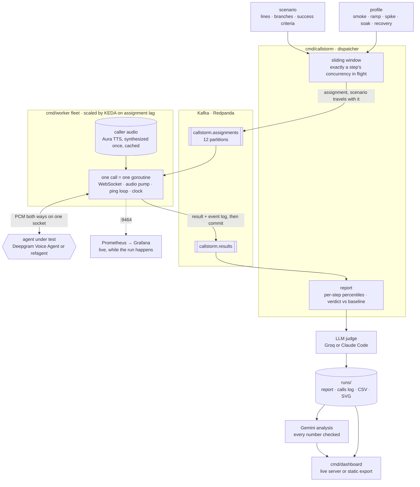
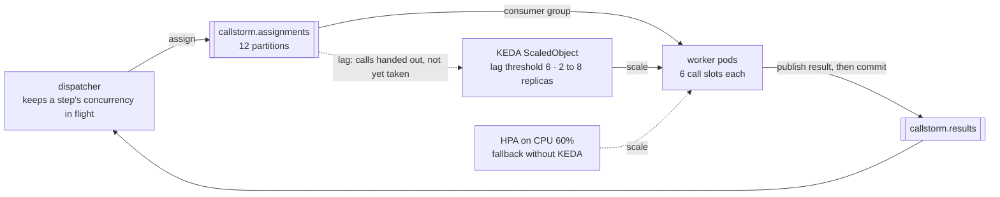
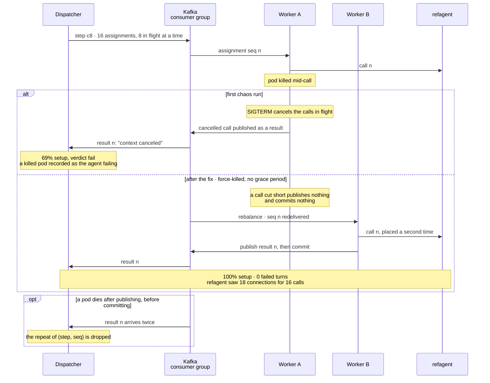
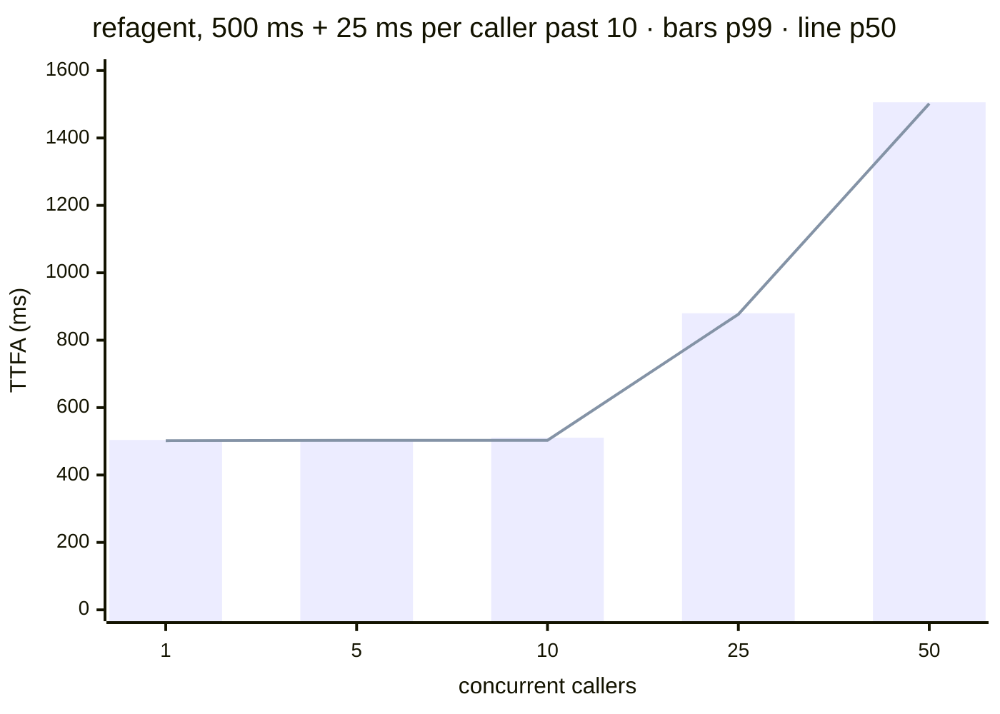
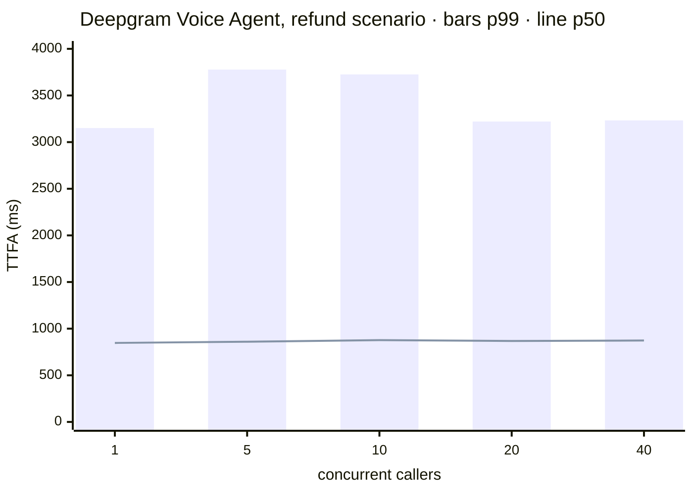
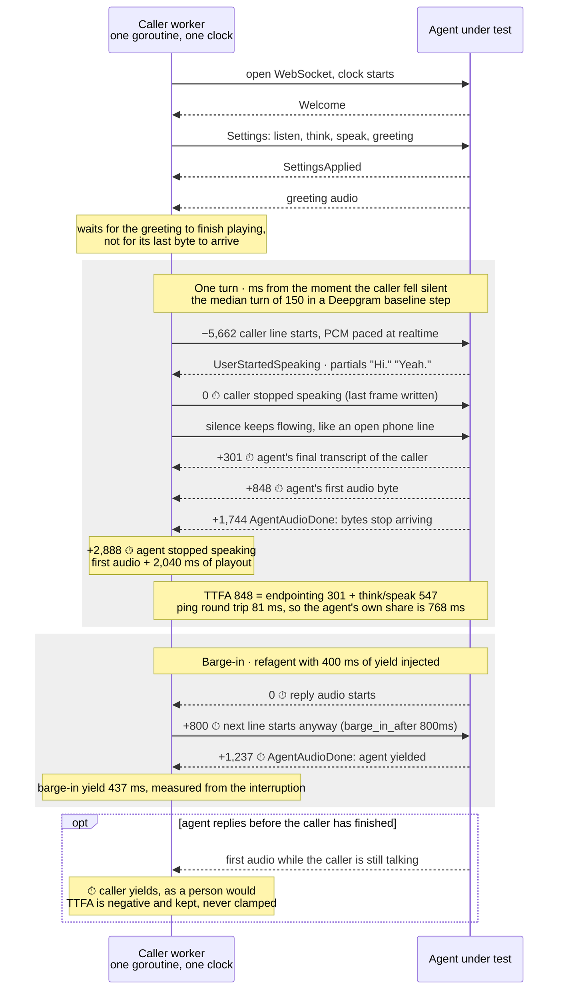

# Technical guide

[Back to the README](../README.md)

Detailed implementation notes, measurement explanations, and recorded experiments.
Commands and artifact paths below are relative to the repository root. Historical
observations describe their recorded tests, not current provider guarantees.
Use the [README quickstart](../README.md#quickstart) for current setup instructions.

Load testing and observability for voice AI agents. k6 for agents that talk.

Callstorm places synthetic calls against a voice agent, speaks to it with real
TTS, listens to what it says back, and stamps every instant on both sides of the
conversation. It answers one question: **at what concurrency does this agent
stop meeting its own baseline?**

**Status: Phase 4.** Single calls, concurrency profiles, a calibrated reference
target, live Prometheus metrics, per-turn events over Kafka, and a judgement
engine: transcript accuracy, barge-in yield, caller personas, branching scripts
and an LLM judge scoring task success. Runs distribute across a Kubernetes
worker fleet with autoscaling, chaos-tested; a run-history dashboard reads the
artifacts. A dedicated analytics store is deliberately deferred.

## How it fits together



The dispatcher decides the load and the fleet supplies the capacity. Kafka
carries calls out and results back, and nothing else passes between them.

## Running a sweep across a fleet

```bash
docker build -t callstorm:dev . && kind load docker-image callstorm:dev --name callstorm
kubectl apply -f deploy/k8s/00-namespace.yaml
kubectl -n callstorm create secret generic callstorm-credentials \
    --from-literal=deepgram-api-key="$DEEPGRAM_API_KEY"
kubectl apply -k deploy/overlays/keda    # broker, target, workers, reports, monitoring, KEDA scaler
kubectl apply -f deploy/k8s/50-dispatch-job.yaml
kubectl -n callstorm wait --for=condition=complete job/callstorm-dispatch --timeout=30m
```

`deploy/` is a kustomization, not a directory to apply wholesale. Pick exactly
one overlay: `deploy/overlays/keda` scales on assignment lag and needs KEDA
installed first (see the comment in its `scaler.yaml`); `deploy/overlays/cpu`
scales on CPU and needs only metrics-server. Both manage a
HorizontalPodAutoscaler on the same Deployment, so applying both makes them
fight. `kubectl apply -k deploy` installs the fleet with no autoscaler at all.
The Jobs under `deploy/k8s/` are never part of a kustomization; each run is
launched explicitly, as above.

The dispatcher writes the run's report, calls log, CSV and SVG to the
`callstorm-runs` PersistentVolumeClaim rather than to its own container, so
they outlive the Job. The `callstorm-reports` Deployment serves that volume
through the same API and dashboard as a local `./bin/dashboard`:

```bash
kubectl -n callstorm port-forward svc/callstorm-reports 8090:8090   # dashboard on :8090
curl -s localhost:8090/api/runs.json | jq -r '.[].id'                # list run ids
curl -O localhost:8090/api/runs/<run-id>/archive.tar.gz              # report + evidence files
```

The archive holds the run's JSON report and whichever companion files exist
(`-calls.jsonl`, `.csv`, `.svg`, `-insights.json`) under their original names,
so it drops straight into a local `runs/` directory. The volume is
ReadWriteOnce, which is why the dispatcher Job is pinned to the report server's
node. Prometheus and Grafana run in the same namespace and are reached the same
way:

```bash
kubectl -n callstorm port-forward svc/grafana 3000:3000      # provisioned dashboard, anonymous viewer
kubectl -n callstorm port-forward svc/prometheus 9090:9090   # Targets page lists every worker pod
```

Prometheus discovers worker pods through the Kubernetes API (pod role, label
`app=callstorm-worker`, port named `metrics`), so a pod the autoscaler adds is
scraped on its next interval without any configuration change. Every replica
should appear on the Targets page as `up` before a run is trusted; the
`callstorm_active_calls` gauge is per pod.

`scripts/verify-infrastructure.py` proves all of the above end to end on a
throwaway kind cluster: it builds the image, applies the kustomization, checks
every worker is a healthy scrape target and that the anonymous Grafana user
cannot edit, launches a run, SIGKILLs the busiest worker mid-step, and then
confirms the report shows every call received exactly once and that the archive
is still served after the Job is deleted and the report server restarted.

On a machine where Smart App Control or another application-control policy
refuses freshly built, unsigned binaries, run the dashboard in a container
instead of turning the policy off -- the block applies to Windows executables,
and the one in the image is Linux:

```bash
docker run -d --name callstorm-dashboard -p 8090:8090   -v "$PWD/runs:/runs:ro" --entrypoint /dashboard callstorm:dev -runs /runs
```

`go run ./cmd/dashboard` also builds and runs a local executable; it can be
subject to the same application-control policy. Use the container option when
local executable launch is blocked.

### Publishing it

The run artifacts are committed, so the history needs no server to read them.

```bash
go run ./cmd/dashboard -runs runs -export dist
```

That writes `dist/` as plain files -- the same JSON the API serves, under the
same paths the page already requests -- so it deploys anywhere static hosting
works. `.github/workflows/pages.yml` publishes it to GitHub Pages on every push
to main, and `vercel.json` builds it the same way. Fetches are relative, so the
page works at a domain root and under a project subpath alike.

The server is still the way to watch a run arriving live; the export is how
someone else reads it afterwards.

Callers used to be goroutines in one process, which meant scaling that binary
to ten replicas would have run ten independent sweeps, each with its own
baseline. Workers now take assignments from Kafka and publish results back.

**The dispatcher still decides what the load is.** It keeps a sliding window of
exactly a step's concurrency in flight and releases another assignment only
when one returns, so a step's percentiles describe that concurrency rather than
however many replicas happen to exist. Workers are capacity; without that
window the achieved load would be a property of the cluster and a sweep would
be measuring the autoscaler.

**Workers hold no run state.** The scenario travels in the assignment and the
caller audio is baked into the image, so a pod that joins mid-run is useful on
its first poll -- and a scaled fleet never pays the text-to-speech bill twice.



**The fleet scales on calls waiting, not on CPU.** A caller spends most of a
call asleep on a socket, so a pod can be full of calls and look idle. Against
the same profile, assignment lag took the fleet from 2 replicas to 8 within 20
seconds of the queue appearing; CPU took about two minutes to reach 7. The
measurement held across the scale-out: 72 calls at 24 concurrent over 8 pods,
100% setup, p95 509ms against an injected 500ms. Lag only appears when a step
out-runs the fleet, so a step smaller than the fleet scales nothing.

That scale-out was measured with a lag threshold of 1 and per-call commits.
The threshold is now 6, one pod's worth of slots, and a worker takes and
commits its slots as one batch, so a new replica joins the group only once the
running batches finish: scale-out lags a step by about one call's duration.

**A batch commits only after every call in it has published its result.**
Workers run a batch's calls concurrently, and Kafka commits an offset, not a
record: acknowledging offset 11 acknowledges 10 with it. Committing each call
as it finished therefore let a fast call 11 commit past an unfinished call 10,
and a crash at that moment lost call 10 for good. A worker now takes at most
`-slots` records per poll, holds the partition assignment until all of them
have completed, and commits the batch once. Any batch that cannot be committed,
including one that contains an unreadable assignment, closes the worker so a
replacement replays the whole batch. A pod killed
mid-call leaves it uncommitted and the group hands that call to a survivor.
Force-killing a pod mid-step, no grace period: the step finished at 100% setup
with no failed turns, and the reference agent recorded 18 connections for a
16-call step. Two calls were placed twice. That is the deliberate trade --
at-least-once delivery costs duplicates and never loses a call.

That behaviour had to be earned. The first chaos run scored 69% setup and a
failing verdict, because a dying worker reported its cancelled calls as
results: a pod being killed had been recorded as the agent failing. Calls
interrupted by shutdown are now abandoned rather than reported.



## Whether the agent was any good, not just quick

Latency says how fast an agent was. These say whether it did its job.

```bash
./bin/callstorm -profile profiles/smoke-deepgram.json -judge
```

**Transcript accuracy (WER).** What the caller actually said, against what the
agent's speech-to-text reported hearing. The caller's script is genuine ground
truth -- Callstorm generated that audio from known text -- so this is not one
transcription being graded against another. It catches the failure no latency
number can: on a live run the caller read out order "four four eight one two",
nova-3 heard "four four eight two", and the agent thanked them for the order
number and carried on toward refunding an order that was never named.

Turns the agent talked over are excluded. The caller stopped mid-sentence, so
the rest of the script was never spoken and charging it to the agent's hearing
would invent errors.

**Task success.** Scenarios carry `success_criteria` in plain language, and a
sampled conversation from each step is judged against them. Every verdict must
quote the turn it was decided on: a judge that can assert without citing is an
oracle, and an oracle is the one number in a run nobody can check. A judge that
fails to run is recorded apart from a criterion that was not met, because "the
agent got it wrong" and "we could not tell" are different results.

**How the judge is asked.** The prompt follows [Coval's guidance on judge
prompts](https://docs.coval.ai/concepts/metrics/writing-judge-prompts). It stays
under 2,000 characters. The parties are only ever *the user* and *the
assistant*. Criteria are numbered, written as something the assistant visibly
says, and use explicit AND, OR and before. Each criterion goes through ordered
gates -- can words decide it, which turns settle it, does its logic hold -- and
anything unclear is not met. The reply quotes and reasons before it gives the
verdict, and three examples anchor the edge cases. A criterion about timing
cannot be read from words, so none is written: a hesitant caller being talked
over is measured by endpointing and talked-over turns instead.

**Checking the judge.** A pass rate is only as good as the judge's agreement
with a person. Copy a run's `-judgements.json`, correct the verdicts you
disagree with, and judge the run again against it:

```bash
./bin/callstorm -scenario scenarios/refund.json -judge-calls 4 \
    -rejudge runs/<run>.json -labels runs/<run>-labels.json
```

That reports agreement per criterion and every disagreement with the judge's
quote, and places no calls. Below 90%, reword the criterion or the prompt and
run it again. `-rejudge` alone re-scores a run whose judge could not run at the
time; it refuses a scenario with a different name, and says so when the file's
criteria have changed since the run.

Two backends. `groq` is an HTTP call that works from CI and constrains the
reply to a JSON schema. `claude-code` spends a Claude subscription instead of
API credits, but needs the CLI installed and logged in.

**Heard versus done.** The verdicts are folded into the run report rather than
written beside it, because the finding needs both halves at once: split the
judged calls by how badly the agent misheard them, and compare how often each
group finished the job. That is what makes word error rate worth measuring. On
its own it is an accuracy statistic nobody has a reason to act on; set against
task outcomes it either points at the transcript as the thing to fix, or shows
the failures are elsewhere and the WER figure is a distraction. It is an
association and reported as one -- nothing assigned which calls were misheard,
and load degrades recognition and everything else at the same time. Below eight
judged calls, or with either group empty, the numbers are shown and the
conclusion is withheld.

**Barge-in.** A caller line with `barge_in_after` starts that long into the
agent's previous reply instead of waiting for it to finish, and the turn records
how long the agent kept talking. An agent that answers in 300ms and then will
not stop when interrupted has taken the floor from the person paying for the
call, and every other metric says it did well. `refagent -yield` injects a known
value so the measurement is calibrated: 400ms injected measured 420ms and 437ms,
the overshoot being the agent checking between audio chunks.

**Personas.** A persona that is only a different voice and script is already
just another scenario file. `pacing.sentence_pause` inserts silence between the
sentences of a line, for a caller who stops to think mid-thought. Against the
reference agent with a 150ms hangover, a caller pausing 900ms mid-line was
talked over on 5 turns out of 5, every one with negative endpointing. The same
agent configuration passes the non-pausing scenario cleanly.

**Branching.** A turn can carry alternatives chosen by what the agent just
said, so the caller responds instead of reciting. Matching is a case-insensitive
substring rather than a regex, because a scenario is read by people deciding
whether a run was fair. Every branch is synthesized before the call starts,
including ones never taken -- rendering a line when it is chosen would put the
text-to-speech round trip inside the window attributed to the agent.

## Quickstart

```bash
go build -o bin/callstorm ./cmd/callstorm
go build -o bin/refagent  ./cmd/refagent

# one call against a local reference agent; caller TTS may incur charges
./bin/refagent -ttfa 800ms -endpointing 300ms &
./bin/callstorm -target ws://localhost:8080/v1/agent/converse
```

Credentials come from `.env` (`DEEPGRAM_API_KEY=...`), which **overrides** the
ambient environment. That direction is deliberate: a stale variable inherited
from some other tool is how you end up billing an account you forgot you had.

Against a real Deepgram Voice Agent, drop `-target`. Caller audio is synthesized
once and cached on disk. Reusing cached caller audio avoids repeated synthesis
charges; real-agent calls and optional model-based reviews can still be billed.

## The load sweep

```bash
./bin/callstorm -profile profiles/sweep-local.json \
    -target ws://localhost:8080/v1/agent/converse -max-concurrency 100
```

```
step         conc   setup   ttfa p50    ttfa p95    ttfa p99    vs base   verdict
baseline     1      100%    502ms       504ms       504ms       1.00x     pass   <- baseline
c5           5      100%    503ms       505ms       506ms       1.00x     pass
c10          10     100%    503ms       510ms       511ms       1.01x     pass
c25          25     100%    877ms       879ms       880ms       1.74x     warn
c50          50     100%    1502ms      1505ms      1506ms      2.99x     fail

BREAKPOINT   c50 at 50 concurrent: p95 TTFA 1505ms is 2.99x baseline
harness      73ms worst-case pacing drift across the run
```

Each run writes a JSON report, a CSV, and an SVG of the curve.

**The same sweep as a chart, with a real agent beside it.** Both runs connected
every call and failed no turns at any step, so there is no error rate to plot.





The reference agent degrades exactly where it was told to. Deepgram's median
barely moves from 1 caller to 40 (847ms to 873ms), while its p99 is above 3.1s
at every step, one caller included: its slowest turns are slow with no load at
all, and the closing line is the usual one (see
[What percentiles hide](#what-percentiles-hide)). The sweep stops at 40 because
Deepgram caps pay-as-you-go Voice Agent connections at 45. The data is
`runs/sweep/20260910-201522-sweep-local.json` and
`runs/deepgram-full-20260913-1644/20260913-164409-sweep-deepgram-30.json`.

**Steps are scored against the baseline step, not an absolute latency target.**
p95 within 1.5x passes, 1.5-2x warns, past 2x fails; call setup below 97% fails
outright. A threshold that is generous for one agent is unreachable for another,
so the run reports degradation rather than a number someone else picked.

**Percentiles are bucketed per step and never pooled across the ramp.** A p95
averaged over a rising ramp mixes the easy start with the hard finish and hides
exactly the degradation the run exists to find.

## The six phases

A profile made only of ramps asks one question: how much at once. Three others
need a phase of their own, and each step names which it is with `kind`.

```json
{
  "name": "hamming-local",
  "baseline": "ramp-c4",
  "steps": [
    { "name": "smoke",      "kind": "smoke",    "concurrency": 1,  "calls": 2  },
    { "name": "ramp-c4",    "kind": "ramp",     "concurrency": 4,  "calls": 16 },
    { "name": "stress-c12", "kind": "stress",   "concurrency": 12, "calls": 36 },
    { "name": "spike-c24",  "kind": "spike",    "concurrency": 24, "calls": 48 },
    { "name": "soak-c8",    "kind": "soak",     "concurrency": 8,  "hold_s": 180 },
    { "name": "recover-c4", "kind": "recovery", "concurrency": 4,  "calls": 16 }
  ]
}
```

**A spike** goes straight to peak with no warm-up, which is what a marketing
email does to a support line and what a ramp never reproduces. **A soak** holds
one load long enough for a leak, a filling queue or a cache going cold to
appear; `hold_s` ends the step on the clock rather than on a call count,
because how many calls fit in twenty minutes is not known until they have been
placed. **A recovery** returns to the baseline's own concurrency afterwards: an
agent that survives the peak and never comes back has failed in a way the peak
itself did not show.

A recovery step is refused unless it runs at the baseline's concurrency and
something before it exceeded the baseline. Compared against a different load it
would not be a recovery measurement, and with nothing to recover from it would
not be a measurement at all.

**Every step is also split in half by when its calls started, and the two
medians compared.** A step is one number per metric, and that quietly assumes
the step was the same thing from start to finish. Drift is what lives in that
assumption: load that never changed and a median that did.

```
phase shape   each step split in half by when its calls started, medians compared
step         phase      held     first half  second half drift     reading
smoke        smoke      83s      402ms       403ms       -         too few turns to compare halves
ramp-c4      ramp       165s     401ms       401ms       +0%       steady
stress-c12   stress     134s     559ms       552ms       -1%       steady
spike-c24    spike      89s      855ms       852ms       -0%       steady
soak-c8      soak       201s     452ms       452ms       -0%       steady
recover-c4   recovery   162s     401ms       402ms       +0%       steady   <- back to baseline
```

The comparison is made on the median, not p95: a half-step carries half the
samples, and a p95 over a dozen turns is one unlucky call rather than a trend.
A step with too few turns on either side reports that it could not tell, which
is deliberately not the same answer as "steady".

## A relative verdict, and published lines on their own clocks

The verdict is relative: each step's p95 against the run's own baseline. It
warns past 1.5x and fails past 2x. The 2x line is the benchmark
[Coval's load-testing guide](https://www.coval.ai/blog/voice-load-testing-methodology)
cites (March 2026); the 1.5x warn line is Callstorm's own. Every page below is
also listed under [Sources](../README.md#sources).

**There is no absolute latency grade.** Published thresholds disagree, often
because they time different things under the same name. Hamming defines TTFW as
call connect to first audio in one guide, and as VAD silence to first audio in
another, with different thresholds for each. So a run is read against
published lines instead. Each line sits on the clock its source defined and
carries its source and date, and none of them is the verdict.

Every step is reported on two clocks:

- **From true end of speech**: TTFA, from the moment the caller's audio actually
  stopped. Callstorm synthesized that audio, so the instant is known rather than
  detected.
- **From detection**: think/speak, from the moment the agent's transcript of
  the caller arrived. That is later than voice activity detection by transcript
  finalization, so a line placed on it is read slightly in the agent's favour.

| line | kind | value | clock | source |
|---|---|---|---|---|
| Hamming observed production median | where agents are | p50 1.4s to 1.7s | end of speech, boundary not stated | Hamming, [Voice AI Latency: What's Fast, What's Slow, and How to Fix It](https://hamming.ai/resources/voice-ai-latency-whats-fast-whats-slow-how-to-fix-it), 2026-01-12 |
| Coval p95 target under load | target | p95 under 2s | end of speech, boundary not stated | Coval, [Voice Load Testing: How to Simulate 10,000 Concurrent Calls](https://www.coval.ai/blog/voice-load-testing-methodology), 2026-03-07 |
| Hamming TTFW breakdown line | target | 800ms, no percentile stated | detection | Hamming, [Voice Agent Analytics & Post-Call Metrics](https://hamming.ai/resources/voice-agent-analytics-post-call-metrics-definitions-formulas-dashboards), 2026-02-10 |
| Human turn-taking marker | human reference | p50 300ms | end of speech | Cekura, [Voice AI Latency: How to Monitor and Improve Every Layer](https://www.cekura.ai/blogs/voice-ai-latency-guide), 2026-09-03 (about 208ms mean human offset, from [Stivers et al. 2009](https://doi.org/10.1073/pnas.0903616106)); the edge Hamming labels natural |

A line whose source states no boundary is read on the widest clock, so holding
it there holds it on any narrower one. A line with no stated percentile is read
at both p50 and p95. The list is `internal/loadgen/references.json`, and every
report copies in the lines it was read against.

**Start from real agents.** Take the two live Deepgram sweeps, 20 steps between
them:
- **Typical wait:** 824ms to 907ms from true end of speech, 512ms to 586ms from
  detection. That is under the 1.4s to 1.7s median Hamming observed in
  production, under Hamming's 800ms TTFW line at the median on that line's own
  clock, and about three times the human marker.
- **The tail:** p95 on the detection clock was past 800ms on 7 of 10 steps.
  Coval's 2s p95 was crossed on 4 of 10.

An earlier version of this README graded the same runs "breakdown at every
step". It had read Hamming's 800ms line on the end-of-speech clock, which is
not the one Hamming defined.

The dashboard appendix maps Cekura's published boundary table (September 2026)
onto what Callstorm measures: which of endpointing, transcript finalization,
model time to first token, tool latency and first TTS byte each Callstorm
number spans. From outside the agent the wait splits in two and no further.

## What the agent contributed, and what the network did

Observed TTFA is what the caller waited through, and it includes the network
between wherever the test runs and the agent's edge. The same agent tested from
two places gets two TTFAs. So every call also pings the agent once a second over
its own connection, and each turn's round trip is subtracted to estimate the
agent's own share:

- **Agent TTFA** is TTFA minus that turn's round trip, and **agent endpointing**
  is corrected the same way.
- **Think/speak needs no correction.** Both of its instants arrive over the same
  connection, so the network cancels out of it.
- **The harness is not subtracted separately.** The clock starts when the
  caller's last frame is actually written, and the pong is read by the same
  goroutine that stamps the agent's reply, so the harness's lag is already
  inside the round trip.
- **The verdict still uses observed TTFA**, because that is what a caller in
  that place experiences.

A ping is answered by the server's WebSocket layer, not the agent, so the round
trip stops at the agent's edge. Everything behind the edge stays in the agent's
share -- speech recognition, the model, the voice, the provider's own internal
hops -- and none of it can be separated from outside.

Checked against the reference agent in kind (500ms injected, 300ms of it
think/speak), at 2 concurrent callers; 8 concurrent matched to within a few
milliseconds except under jitter:

| cohort | observed p50 | round trip p50 | agent p50 | agent endpointing p50 |
|---|---|---|---|---|
| clean | 503ms | 0.7ms | 502ms | 201ms |
| delay-100 | 603ms | 101ms | 502ms | 201ms |
| loss-3 | 503ms | 0.6ms | 502ms | 201ms |
| jitter-50 | 2157ms | 1531ms | 664ms | 370ms |

**Delay is removed exactly.** 100ms was added to the network, 101ms measured,
and the agent's share is back at clean's 502ms.

**Jitter is removed only in part.** The median round trip took about 1.5s off a
2.2s wait but left the agent's share 160 to 200ms high at the median and 700 to
830ms high at p95. Most likely the queue jitter builds in the send buffer
changes from moment to moment, and the pings sample it at different instants
from the audio they stand in for. On a line that queues, agent TTFA is much
closer to the truth than observed TTFA, and still an overestimate.

Checking this locally found a bug. On Windows, Go's clock measured some loopback
round trips as exactly zero, and zero had been read as "no pong", dropping a
third of a run's turns from the correction. Whether a pong came back is now
recorded apart from its value.

## What percentiles hide

A step's percentiles answer how slow its slow turns were. Coval's and Hamming's
guides on testing voice agents ask more of a load test than that, and most of
it can be read from what a run already records:

| figure | what it is | where it comes from |
|---|---|---|
| **Quality verdict** | Whether a step still did the job as well as the baseline, beside the verdict on speed. The first step it fails at is the quality breakpoint. | Scenario checks and the judge's task success, words misheard, talked-over turns, failed turns |
| **Wait per turn** | The wait at each turn of the conversation, across a step's calls, with what the caller said on it. | The calls log |
| **Wait bands** | A step's turns counted by the caller's wait: up to 800ms, to 1.2s, to 2s, and over. | The calls log |
| **Repeated replies** | Replies that said again what the agent already said earlier in the same call. | The agent's words |
| **Slow calls against done** | Whether judged calls with any wait past 1.2s did the job less often than the rest. | The judge's verdicts and the calls log |
| **Leading silence** | How long a reply stays silent after its audio starts arriving, before the first sound a caller could hear. Audible TTFA adds it to TTFA. | The agent's audio, as it arrives |

**Quality is scored apart from speed.** An agent that answers as fast as ever
while it stops finishing the task passes a latency verdict. Each step is held to
the baseline step, and in a matrix to the clean cohort's:

- **Task success.** A scenario check's or the judge's pass rate dropping more
  than 5 points warns and more than 10 fails, Hamming's gate for task completion
  under load ([Voice Agent Load Testing Guide](https://hamming.ai/resources/voice-agent-load-testing-guide),
  May 2026), which gives the drop in percent; it is read here as points.
- **Hearing.** Words misheard rising more than 2 points warns, Hamming's ±2%
  [regression tolerance](https://hamming.ai/resources/voice-agent-testing-guide);
  a rise that also leaves the step above 15% fails, where
  [Hamming calls recognition poor](https://hamming.ai/resources/voice-agent-evaluation-metrics-guide).
- **Interruptions.** Talked-over turns rising more than 5 points warns; above
  10% of turns fails, [Hamming's line for poor](https://hamming.ai/resources/voice-agent-analytics-post-call-metrics-definitions-formulas-dashboards).
- **Failed turns.** Held to [Hamming's error-rate bands](https://hamming.ai/resources/testing-voice-agents-production-reliability)
  rather than the baseline: more than 0.5% of turns warns, more than 1% fails.

A rate is compared only with 30 checks on both sides, which is Callstorm's own
floor, and each step lists what it compared. A pass that could compare only
failed turns says little, and says so. A judge sampling four calls a step never
reaches 30, so task success enters the verdict only when enough calls are judged.

**The wait per turn is where a slow moment shows.** On the Deepgram suite the
closing line, "Alright, that works. Thanks for sorting it out.", was the slowest
turn in every scenario: p95 about 3.2s in four of them against about 1s on the
other turns. Pooled into a step's p95, one slow turn in five did not stand out.

**Leading silence is measured the way
[Coval's time-to-first-audio benchmark](https://www.coval.ai/blog/time-to-first-audio-ttfa-benchmark)
defines onset** (September 2026): the start of the first 10ms window, stepped 1ms
at a time, whose RMS is above 0.01 of full scale. A provider can send its first
byte quickly and still keep a caller waiting through silence; Coval measured one
sending a median 225ms of it. Each reply is placed on its own playout, so a chunk
that arrives late adds its gap too, as it would for a caller. Checked against the
reference agent with `-lead-silence 225ms`:

| step | silence p50 | silence p95 | audible TTFA p50 |
|---|---|---|---|
| 1 at once | 216ms | 216ms | 717ms |
| 2 at once | 216ms | 216ms | 717ms |
| 3 at once | 216ms | 245ms | 717ms |

216ms is the answer the definition gives, not an error. The first window loud
enough starts 9ms before the tone, once it holds a few samples of it. The 245ms
turn is a chunk that arrived late on a busy machine, which a caller would have
heard as silence.

**Runs placed before these figures existed gain them from their calls logs**,
except leading silence, which needs the audio:

```bash
./bin/callstorm -refresh runs/<run>.json        # one report
./bin/callstorm -refresh runs/<directory>       # every report in it
```

Latency and its verdict are left as written. The analysis is rewritten after,
when `GEMINI_API_KEY` is set, since it reads the figures that changed.

## Questions a run answers

Every report on the dashboard opens with plain-language questions: the ones a
person who has never heard of p95 or endpointing would actually ask. Each
answer is worked out from that run's own numbers and comes with a chart of the
evidence. A question the run can't answer says why, and what would answer it.

Each answer follows a fixed rule, so it can be checked against the report:

| question | how it's answered |
|---|---|
| How many calls at the same time can it take before callers notice? | The first level where the slowest callers (p95) wait more than twice as long as at normal load, or fewer than 97 calls in 100 connect. The answer is the range between the last level that held and the first that didn't. |
| Does it get worse at the job before it gets too slow? | The first level whose quality verdict fails, against the first whose speed verdict does. A speed failure with every busier level passing is not counted as the load. |
| Does it slow down gradually or all of a sudden? | If one jump between neighbouring levels holds 60% or more of the total slowdown, it was sudden. When that jump spans a doubling of load, the answer says the test may have missed a steady climb in between. |
| Do all callers get slower, or only some? | The typical caller (p50) against the slowest (p95), each as a multiple of normal. If the slowest grows at least 0.3 more and the typical stays under 1.2 times, only some calls are stuck. |
| Do new kinds of problems show up when busy? | Every turn is split into answered normally, agent cut the caller off, no answer in time, other errors, and call never connected, and each kind is reported where it first appears. |
| Where does the waiting time go? | A typical turn split into the network round trip, the agent noticing the caller stopped, the agent thinking up its reply, and, where measured, silence at the start of the reply; and which part grew most with load. |
| Which moment in a call keeps callers waiting longest? | The turn of the conversation with the highest p95 at the heaviest level, when it is at least 1.5 times the middle of the other turns. Slow at normal load too means it comes from what is said on it. |
| How often does a caller wait long enough to notice? | The share of turns past 1.2 seconds, where [Coval says](https://www.coval.ai/blog/voice-ai-latency) callers start repeating themselves; a rise of 2 points counts as load making it worse. |
| Can it cope with a sudden rush as well as a slow build-up? | A spike step against a built-up step at the same load. Within 1.2 times counts as coping. |
| After a rush, how long until it's back to normal? | Seconds from the start of the recovery step to the first call from which every later call's typical wait stays within 1.2 times normal, with none failing. |
| Does it get slower the longer it runs? | The steady (soak) step split in half by start time; a 15% change in the typical wait counts. |
| Does it still hear people correctly when busy? | Words misheard at each load, against the exact script the test caller spoke. A rise of 2 points counts. |
| Does it still do its job when busy? | Each scenario node's assertion pass rate at each load, or the judge's pass rate when no node is checked. A drop of 10 points counts. |
| Do the calls that kept people waiting go worse? | Judged calls with any wait past 1.2 seconds against the rest; a gap of 10 points counts. Needs 8 judged calls and both groups. |
| Does it talk over people more when busy? | The share of turns where the agent spoke before the caller finished. A rise of 5 points counts. |
| Does it talk longer or faster when busy? | Seconds of agent speech per turn, and words per minute. A 15% change counts. |
| Does it repeat itself more when busy? | The share of replies repeating an earlier one in the same call; a rise of 2 points counts, and under 3% is where [Hamming rates repeated questions excellent](https://hamming.ai/resources/conversational-flow-measurement-voice-agents). |
| How much worse on a bad network connection? | From an impairment matrix: which network conditions broke it, and the worst step's wait as a multiple of the same step on a clean network. |
| Does each turn cost more when busy? | Price per turn, or billed call time per turn without a rate. A 5% rise counts. |
| Did the test itself keep up? | How far the test caller fell behind real time in each step (past 100ms a step is doubtful), on distributed runs whether every call came back exactly once, and how many turns the thinnest step's percentiles rest on: a p95 from fewer than 20 is its slowest turn, and a p99 needs 100. |
| Would the same test give the same answer again? | Earlier runs with the same scenario and load plan fingerprints against the same agent. Within 10% on the slowest waits at normal and heaviest load counts as repeatable. |

A run whose test machine fell behind real time opens with a caution that its
answers are rough. The last card lists what this kind of test can't answer at
all: what runs out inside the agent, whether a limit is the agent's or its
providers', tool calls, post-call events, handoffs to humans, audio quality,
alerts, and callers losing patience. The test caller is patient by design, so it
never talks over a slow agent.

`profiles/questions-ref.json` is shaped to answer as many of these as possible
against the reference agent. It has a sudden rush and a slow build-up to the
same level, a recovery step, and a steady hold.

## Written analysis

When `GEMINI_API_KEY` is set, every run ends with a written analysis, stored
beside its report as `<run>-insights.json`. A run placed with `-suite` also
rewrites `<suite>-insights.json` beside its parts, so the test's analysis reads
every part placed so far. Both dashboards show it next to the plain-language
answers, which stay rule-based.

```bash
./bin/callstorm -insights runs/<run>.json      # one run, and its suite
./bin/callstorm -insights runs/<directory>     # every run and suite in it
```

Gemini's free tier caps requests per day, and a suite of five runs needs six.
Past the cap, or with no key, `-insights-backend claude-code` writes the
analyses with Claude through the Claude Code CLI on a Claude subscription,
Claude Opus 5 unless `-insights-model` names another. The number check below
applies whichever model wrote them.

The model reads a digest of each report -- steps, quality figures, the judge's
summary and the run's reference lines -- plus figures per turn of the
conversation from the calls log. That is where a turn slower than the rest shows
up, which no step percentile can show. It is told to look for the patterns Coval
and Hamming write about: where the wait goes, whether latency follows load, the
tail breaking while the median holds, quality slipping while latency holds, a
slow turn, scenarios that differ, and whether the test itself can be trusted.

**Every number it writes is checked against the data.** A number must appear
in the digest, rounded, or in the unit the sentence gives it in: milliseconds as
seconds, a fraction as a percentage. A claim with any other number is dropped
and listed as dropped, with the number, so an invented figure never reaches a
reader looking like a measured one. Small counts written without a unit are
exempt. Each analysis records the model, when it was written, and hashes of the
instructions and the data it read.

**It does not repeat itself, or the rest of the page.** Each insight has to be
a different finding. One that cites evidence an earlier insight already cited,
or reuses its title, is dropped and listed as a repeat. Its instructions leave
out what the plain-language answers already say beside it -- the slowest turn,
long waits, quality, whether the test kept up -- unless it connects them to
something they cannot show. A suite's analysis keeps to findings across its
scenarios, since each part carries its own. And an analysis whose data,
instructions and model have not changed is not written again: asking twice
would only put a second wording of the same answer on the page.

`-insights-model` picks the model; the default is Gemini's generally available
Flash model. An analysis that cannot be written is reported and never fails the
run.

## The calls log

Every call a run places is written to the calls file beside its report, failed
ones included:

- **Each call:** when its clock started and when it hung up; its full event log,
  each event in milliseconds from that start, including every ping and its
  round trip; and its error, if it failed. A call that never connected has an
  empty list of turns.
- **Each turn:** when the caller began the line, plus the raw instants behind
  every duration: caller started, caller stopped, the agent's transcript
  arrived, first audio, playout ended.
- **Each step:** when it started and ended, and a timeline of every call in start
  order with its typical wait. Recovery steps also record how long they took to
  get back to normal.

The report also records network cohorts' start and end times, when each judge
verdict came back, when the run ended, and fingerprints of the scenario and
load plan exactly as they ran. Together these let any number on the dashboard be
recomputed from the files.

## Why there is a reference agent

`cmd/refagent` speaks the Deepgram Voice Agent wire protocol but has no STT, no
LLM and no TTS. It waits a configured number of milliseconds and emits a tone.

That makes it the calibration instrument. Injected latency is known exactly, so
a measured TTFA that disagrees means Callstorm is wrong and nothing it reports
about a real agent can be trusted:

| injected | measured | at |
|---|---|---|
| TTFA 800ms | 802-808ms | 1 caller |
| endpointing 300ms | 300-302ms | 1 caller |
| 500ms + 25ms per caller past 10 (predicts 875ms) | 878ms | 25 callers |
| same (predicts 1500ms) | 1503ms | 50 callers |

It is also a load target with no bill and no rate limit, which matters because
Deepgram caps Voice Agent connections at **45 concurrent on pay-as-you-go**. The
preflight refuses a profile that would exceed it rather than let connection
refusals get reported as agent failures.

## What it measures, and why it is split up

The headline number is **time to first audio**: the caller stopped talking, and
this is how long the line stayed dead before the agent's first audio arrived.

```
caller stops talking
   |
   |<--- endpointing --->|<--- think + speak --->|
   |                     |                       |
   |            agent decides the         agent's first
   |            turn is over              audio byte
   |
   |<------------------ TTFA ------------------->|
```

**Endpointing** is turn-detection tuning. **Think + speak** is model and TTS
choice. Different teams' problems, and against a real agent they behave
completely differently:

| | spread across 11 turns, 3 runs |
|---|---|
| endpointing | 239-319ms (80ms) |
| think + speak | 439-2088ms (4.8x) |

Endpointing is metronome-stable. All the tail latency lives in think + speak.

**One call, instant by instant.** The turn is the median of 150 in the baseline
step of `runs/deepgram-full-20260913-1644/20260913-164409-sweep-deepgram-30`.
The barge-in is from `runs/20260912-170100-refund-bargein.json`, against the
reference agent.



**The same turn as a waterfall.** From outside the agent the wait splits in two
and no further: endpointing holds turn detection and transcript finalization,
and think + speak holds the model and the first chunk of speech. The reply's
audio finished arriving in 896ms and took 2,040ms to play, which is why the
caller waits for playout rather than the last byte.

```mermaid
gantt
    title One turn against Deepgram, seconds after the caller fell silent
    dateFormat x
    axisFormat %S.%L
    tickInterval 250millisecond
    todayMarker off

    section Network
    ping round trip 81 ms       : 0, 81
    section Agent hears
    endpointing 301 ms          : 0, 301
    section Agent answers
    think and speak 547 ms      : 301, 848
    section Reply audio
    bytes arriving 896 ms       : 848, 1744
    playing out 2040 ms         : 848, 2888
```



[Hamming's analytics guide](https://hamming.ai/resources/voice-agent-analytics-post-call-metrics-definitions-formulas-dashboards)
(February 2026) starts TTFW at VAD silence *detection*, which leaves endpointing
outside the number. [Cekura's latency guide](https://www.cekura.ai/blogs/voice-ai-latency-guide)
(September 2026) makes the same point from the other side: a clock that starts
after endpointing fires hides a delay the caller still sat through. Callstorm
starts from when the caller actually stopped, because it generated the audio and
knows the ground truth, and reports the detection clock beside it. That is the
payoff of driving the caller synthetically.

Also reported: **`heard`**, what the agent's STT actually transcribed. When it
diverges from what the caller said, the agent answered a different question -- a
failure no latency metric catches.

## How the measurement stays honest

**Caller audio is paced at realtime, and never bursts to catch up.** Endpointing
runs on audio duration, not on how fast bytes arrive, so pushing PCM at the
socket as fast as it is accepted measures nothing. Frames are scheduled against
absolute deadlines; when the pump falls behind under load it re-anchors rather
than replaying missed deadlines back to back, because catching up would push
audio out *faster* than realtime and corrupt the agent's turn detection.

**Every run reports its own pacing drift.** ~20ms at low concurrency. If a step
exceeds 100ms it is flagged: at that point this machine, not the agent, is the
limit on the test. A load generator that cannot show it was not the bottleneck
is not measuring anything.

**The line never goes silent.** When the caller has nothing to say the pump
sends silence, like an open phone line. Turn detection needs to hear it.

**The agent finishes speaking before the caller replies.** Deepgram streams TTS
about 1.5x faster than realtime, so `AgentAudioDone` is when audio stopped
*arriving*, not when the agent stopped *talking*. Callstorm tracks playout and
waits for it.

**The caller yields when talked over.** If the agent starts speaking mid-
utterance the caller stops, as a person would. Carrying on spills the rest of
the utterance into the next turn and silently corrupts it.

**Negatives are kept, never clamped.** A negative TTFA means the agent started
talking before the caller finished -- the single most interesting thing a run
can find.

## Live metrics

```bash
./bin/callstorm -profile profiles/sweep-local.json -metrics :9464 ...
docker compose -f deploy/docker-compose.yml up -d   # Prometheus + Grafana
```

Histograms for TTFA, endpointing, think/speak, turn latency and harness drift,
all labelled by step; a gauge for active calls; counters for turn and call
outcomes. Grafana opens straight onto the provisioned dashboard at
`localhost:3000`.

**Turns are recorded as they finish, not when their call ends.** Under load
every call in a step completes at roughly the same moment, so reporting at call
end would deliver a step's measurements in one burst after the step was already
over -- useless for watching an agent buckle.

**`/metrics` is held open for `-metrics-linger` (default 5s) after the run.**
A step's turns land in the registry as that step ends, and the breakpoint is by
definition the *last* step. Exiting the instant the run finished dropped
exactly the numbers the run exists to produce, and left `active_calls` frozen
at its last non-zero value instead of back at rest.

**The stack needs Prometheus 3.8 or newer**, where native histograms became a
scrape-config setting rather than an experimental command-line flag. Each
latency histogram is exposed twice: native buckets grow by a fixed ratio and
resolve a quantile to about 1% of its own value, while classic fixed buckets
can only place it somewhere inside the bucket it fell in. On one run whose true
p95 was 504ms, the classic buckets drew it at 738ms -- and reported two
different concurrency steps as identical, because both fell in the same bucket.
The percentile panels read the native series; the distribution heatmap reads
the classic ones, which is what a heatmap needs.

Percentiles on the dashboard are for watching a run happen. The exact figures
come from the run report, which sorts the real durations.

## Per-turn events over Kafka

```bash
./bin/fakekafka &                                    # in-process broker, no Docker
./bin/collector -kafka localhost:9092 &
./bin/callstorm -profile ... -kafka localhost:9092
```

The volume is tiny -- a few thousand events per run -- so Kafka is not here for
throughput. It is here so workers and the metrics sink scale independently, and
so **consumer lag is the backpressure signal**: if the collector keeps up while
callers are placing calls, the measurement pipeline had headroom.

Produces are fire-and-forget. A caller goroutine is holding a live socket on a
realtime audio deadline; blocking it for a broker ack would delay the next frame
and corrupt the measurement the event is reporting.

`cmd/fakekafka` runs a real Kafka protocol implementation in-process, so the
pipeline is runnable and testable without Docker or a JVM.

## Network impairment

```bash
docker build --target impair -t callstorm-impair:dev .
kind load docker-image callstorm-impair:dev --name callstorm
kubectl apply -f deploy/k8s/60-impair-job.yaml
```

`-impairments profiles/impairments.json` runs the load profile once per network
condition and reports a grid of load against network. One pod places every call
itself and reshapes its own interface with `tc netem` between cohorts:

| profile | loss | jitter | added delay |
|---|---|---|---|
| `clean` | 0% | 0ms | 0ms |
| `light` | 1% | 20ms | +100ms |
| `moderate` | 3% | 50ms | +100ms |
| `severe` | 5% | 100ms | +200ms |

**Clean always runs first.** An impaired cohort is scored against the clean
cohort's baseline from minutes earlier, not its own: a severe network measured
against a severe-network baseline passes, and says nothing about what the
network cost. A file without a `clean` profile gets one; a `clean` that sets
any impairment is refused.

**Cohorts run one after another.** Side by side, the target would carry every
cohort's calls at once and each cohort's latency would include load it did not
place.

**Every cohort records the command exactly as it ran, and the kernel's answer.**
`tc qdisc show` is read back after each change, and a cohort whose interface
does not show the netem it asked for is an error rather than a clean run with an
impaired label.

**Impairment is egress only, on the caller's side.** It is a bad connection at
the customer's end. Delay on the uplink should land in *endpointing*: the agent
hears the caller stop late, then replies at its usual speed.

**Over a WebSocket target, every cell is a latency.** WebSocket is TCP, so a
dropped packet is retransmitted rather than lost, and nothing in the grid says
how a call sounded.

**Measured against the in-cluster reference agent** (500ms injected TTFA, 300ms
of it think/speak), with `scenarios/graph-ref.json`, c2 and c8:

| cohort | network | p95 c2 | p95 c8 | where it went |
|---|---|---|---|---|
| clean | none | 507ms | 509ms | |
| delay-100 | +100ms | 604ms (1.19x) | 607ms (1.19x) | the injected 100ms, to within 3ms |
| loss-3 | 3% loss | 503ms (0.99x) | 508ms (1.00x) | nothing |
| jitter-50 | +100ms ±50ms | 2719ms (5.36x) | 2833ms (5.57x) | a queue in the caller's send buffer |
| light | +100ms ±20ms, 1% | 863ms (1.53x) | 794ms (1.50x) | endpointing +124ms at p50, think/speak +0 |
| moderate | +100ms ±50ms, 3% | 3550ms (6.29x) | 3059ms (5.80x) | endpointing |
| severe | +200ms ±100ms, 5% | 7056ms (12.49x) | 6589ms (12.49x) | endpointing |

Delay lands where it should, in endpointing. The agent hears the caller stop
late, then replies at its usual speed: think/speak held at 300ms in every cohort.

**Jitter, not loss, makes the multi-second cells.** 3% loss alone moved nothing.
The same 100ms delay with ±50ms of jitter added made p95 five times worse. netem
draws each packet's delay independently, so jitter reorders packets. TCP read
that reordering as congestion. `ss -tin` inside the calling pod during that
cohort showed a congestion window of 2 to 5 packets and 18 to 72KB of audio
unsent in the send buffer, 0.4 to 1.5 seconds of 24kHz speech. During the
loss-only cohort the send queue was empty.

The latency was not building up over the call: moderate's median TTFA was
2.4s on turn one and 2.3s on turn five.

**Treat the jittered rows as an upper bound.** Real paths rarely reorder one
flow the way per-packet netem jitter does, so these rows overstate what a bad
caller network does to a WebSocket agent. Delay-only and loss-only cohorts are
the clean calibrations.

The calibration run's JSON was lost when its pod exited before it was copied
out; its terminal report is kept in `runs/impair-calib/`. The matrix run is in
`runs/impair/`.

The matrix refuses `-distributed` (the fleet's calls leave from pods this
interface does not cover), `-kafka` and `-judge` (both key on step names, which
repeat in every cohort).

## Scenario graph

A turn is a node. It can carry an `id`, an `expect` on the agent's reply, and
branches that `goto` another node:

```json
{
  "id": "number",
  "say": "Sure, it's four four eight one two.",
  "expect": { "said_any": ["replacement"], "not_said": ["refund"] },
  "branch": [
    { "if_agent_said": "order number", "say": "I just gave it to you.", "goto": "number" }
  ]
}
```

Every node is scored per step: visits whose reply met the assertion over visits
to a node that has one. Completion can hold while one node collapses, and a
call-level rate would average that node in with the ones that held.

- **An assertion is a substring, like a branch.** A failed node is explained by
  pointing at the transcript, and the first failing reply is kept as evidence.
- **A visit with no reply fails.** A node that times out has collapsed.
- **Unvisited nodes stay in the table with zero visits.** In a graph, a branch
  that never fired is a finding.
- **A graph that can loop must set `max_turns`.** A call that never ends is a
  hung worker, not a result.
- **The next node is chosen before the line is spoken**, from the agent's
  previous reply, so a barge-in on the next node still arms against this turn.

`scenarios/graph-ref.json` is the known-answer version. refagent's replies are
fixed, so the branch, the jump and the rates are decided in advance: `open`
100%, `number` 100% over two visits a call, `refund` 0%, and `close` unscored.
Against a local refagent it reported exactly that.

## Harness event integrity

This checks Callstorm's pipeline, not the target's. Callstorm does not receive
the target's webhooks.

On a distributed run, every step counts calls dispatched, calls that came back,
duplicates, calls that never came back, and results that arrived after their
step closed. Delivery is at-least-once by design, so a duplicate is expected
when a worker dies between publishing and committing. A duplicate is now dropped
by `(step, seq)`; before this, it would have put one call's turns in a step twice
and ended the step a call early. With `-kafka`, turn events published and
dropped are recorded beside it.

## A real finding, already

On one run against Deepgram the agent endpointed after a 300ms pause following
the word "No", started replying 4.8 seconds before the caller had finished, and
was truncated to 520ms of audio when the caller's continued speech barged in.
The reply -- "I understand you might not want a refund" -- was the opposite of
what was asked, because it had only heard "No."

```
turn  ttfa       endpointing   think+speak   agent spoke
2     -4809ms    -5254ms       444ms         520ms       agent talked over the caller
```

Same scenario, byte-identical caller audio, two other runs: no barge-in at all.
Identical input, divergent turn detection. That is the argument for running a
scenario many times rather than once, and it is why the caller's audio is cached
and reused rather than regenerated.

## Layout

```
cmd/callstorm        CLI, report card, sweep
cmd/dashboard        run browser; one embedded HTML page and its stylesheets
cmd/refagent         calibrated reference target
cmd/collector        consumes turn events, reports consumer lag
cmd/fakekafka        in-process Kafka broker for local runs
internal/worker      one caller: websocket, turn state machine, audio pump
internal/loadgen     load phases, per-step aggregation, verdicts, task-success join, matrix, nodes
internal/impair      netem profiles, tc commands and their readback
internal/metrics     the clock: event log and metric derivation
internal/audio       frame math, playout, call recorder
internal/chart       sweep SVG
internal/telemetry   Prometheus
internal/bus         Kafka producer, consumer, lag
internal/tts         Aura synthesis with a shared cache
internal/scenario    scenario schema
```

One caller is one goroutine owning a socket, a state machine and a clock.
Everything else is plumbing around the timestamps.

## Remaining work

SIP/PSTN calling, additional provider adapters, and verification of external
side effects are not implemented. A dedicated analytics store is deferred;
report files remain the dashboard's source of truth. See the repository's
issues and current code before planning work from historical phase labels.
